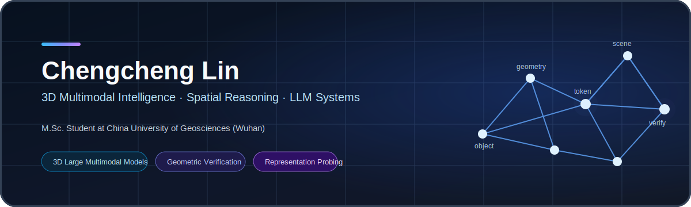
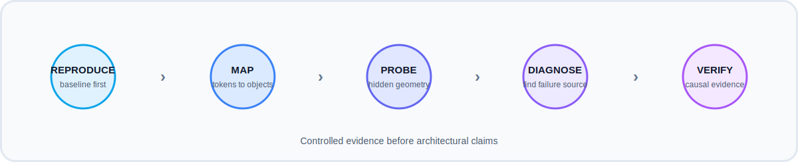

<p align="center">
  
</p>

<p align="center">
  <a href="mailto:linchengcheng@cug.edu.cn">
    
  </a>
  <a href="YOUR_GOOGLE_SCHOLAR_URL">
    
  </a>
  <a href="YOUR_HOMEPAGE_URL">
    
  </a>
  
</p>

## About

I am an M.Sc. student in **Geoinformation Engineering** at the  
**China University of Geosciences (Wuhan)**.

My research focuses on **3D multimodal intelligence**: how models perceive a
3D scene, preserve geometric information, ground language to objects, and
perform spatial reasoning that can be **diagnosed and verified**.

I previously worked as an algorithm intern at **DP Technology**. I am currently
building reproducible research pipelines around representation probing,
multimodal alignment, controlled ablations, and geometric verification.

<table>
<tr>
<td width="50%" valign="top">

### Primary focus

- 3D large multimodal models
- spatial and geometric reasoning
- 2D–3D–LLM representation alignment
- object-centric and scene-level understanding
- grounding and reasoning error diagnosis

</td>
<td width="50%" valign="top">

### Secondary interests

- LLM agents and memory
- retrieval-augmented generation
- vision-language-action models
- world models
- multimodal interpretability

</td>
</tr>
</table>

---

## Research agenda

<p align="center">
  
</p>

My current work is organized around four questions:

1. **Representation** — What geometric information survives after 3D features enter an LLM?
2. **Grounding** — Can each language token or hidden state be traced back to the correct scene object?
3. **Reasoning** — Does the model infer spatial relations, or merely exploit semantic correlations?
4. **Verification** — Can explicit geometry tools detect and correct inconsistent reasoning?

---

## Current work

<table>
<tr>
<td width="50%" valign="top">

### Chat-Scene alignment and probing

Studying object-level 2D/3D representations and their evolution inside the LLM.

**Current experiments**

- layer-wise hidden-state probing
- 2D–3D feature alignment
- relation and relative-position decoding
- token-to-object mapping audits
- feature-shuffle causal controls

</td>
<td width="50%" valign="top">

### Verifiable spatial reasoning

Building a framework that separates perception, grounding, and reasoning errors.

**Current directions**

- scene graphs and geometric representations
- deterministic geometry tools
- grounded chain-of-thought supervision
- inference-time consistency checking
- structured error taxonomies

</td>
</tr>
<tr>
<td width="50%" valign="top">

### 3D multimodal baselines

Reproducing and analyzing representative systems:

`Chat-Scene` · `LEO` · `SceneCOT` · `PointAlign` · `CLASP`

The objective is not only to match reported metrics, but to identify which
components provide measurable causal gains.

</td>
<td width="50%" valign="top">

### Research engineering

I maintain experiments as auditable systems:

- fixed data splits and seeds
- explicit token-to-object mappings
- configuration and checkpoint tracking
- probe baselines and negative controls
- structured logs and reproducible scripts

</td>
</tr>
</table>

---

## Selected projects

> Replace the placeholder links after the repositories are public.

<table>
<tr>
<td width="33%" valign="top">

### [3D Representation Probe](YOUR_REPOSITORY_URL)

Layer-wise analysis of object tokens and geometric information retention in
3D large multimodal models.

`PyTorch` `Transformers` `3D LLM`

</td>
<td width="33%" valign="top">

### [Verifiable Spatial Reasoning](YOUR_REPOSITORY_URL)

Geometry-aware evaluation, reasoning traces, consistency checks, and structured
failure analysis.

`Spatial Reasoning` `Verifier` `Benchmark`

</td>
<td width="33%" valign="top">

### [3D Multimodal Reproduction](YOUR_REPOSITORY_URL)

Reproduction notes, controlled experiments, architecture diagrams, and
evaluation pipelines for 3D multimodal systems.

`Reproduction` `Ablation` `Evaluation`

</td>
</tr>
</table>

---

## Research principles

```text
Reproduce before modifying.
Map representations before aligning them.
Diagnose before optimizing.
Separate grounding, representation, and reasoning.
Use negative controls before claiming causal improvement.
Prefer falsifiable evidence over metric-only narratives.
```

---

## Technical stack

<p>
  
  
  
  
  
  
  
  
</p>

**Machine learning:** PyTorch, Transformers, PEFT/LoRA, Hugging Face  
**3D and multimodal:** point clouds, 3D detection, Mask3D, Uni3D, DINOv2  
**Research systems:** Linux, Slurm, Docker, Git, Git LFS, CUDA

---

## Collaboration

I am interested in research internships, RA opportunities, and collaborations
related to:

- 3D multimodal reasoning
- embodied and spatial intelligence
- interpretable multimodal systems
- LLM agents and memory

For research discussions, contact me at **YOUR_EMAIL**.

<!--
Optional GitHub statistics.
Replace YOUR_GITHUB_USERNAME and uncomment after the profile is public.

<p align="center">
  
  
</p>
-->
